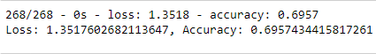
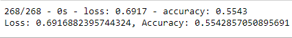

# Neural_Network_Charity_Analysis

## Purpose
The purpose of this analysis is to create a Neural Network Model that can be used to determine which organizations will be successful if funded by Alphabet Soup.

## Results

### Data Preprocessing
- The Is_Successful column is considered the target for the model
- There are several columns considered the features for this model: Application Type, Affiliation, Classification, Use Case, Organization, Active Status, Income Amount, Special Considerations, and the Ask Amount.
- The EIN and Name columns are neither targets nor features, and were removed from the input data

### Compiling, Training, and Evaluating the Model
- I selected 2 hidden layers with 80 and 30 neurons respectively, using the relu activation because the data is positive and nonlinear. The outputlayer used the sigmoid activation because this function is ideal for binary classification.
- I was unable to achieve the target model performance of 75%
- In an attempt to reach the target model performance, I removed 2 more features (Special Considerations and Affiliation), added 1 more hidden layer with 10 neurons, and decreased the epochs to 50.

## Summary
In summary, it is difficult to tell whether an organization will be successful from a donation from AlphabetSoup based on the data we have. A Support Vector Machine Model may be more effective because it can focus on the bigger picture of the data, and specializes in binary classification. From what I can see, the Deep Learning Model is unable to interpret this particular data successfully.